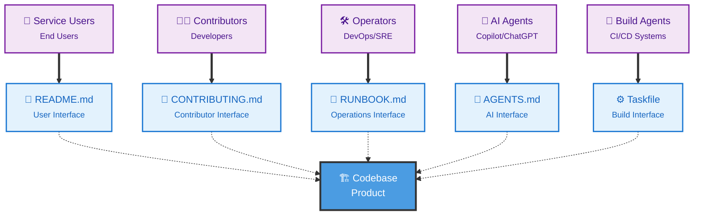

# Codebase Interface

A presentation from [Codebase Interface](https://codebaseinterface.org)

---

## What is Codebase Interface?



---

## Vertical Slides

Press down arrow for more

--

## Nested Slide 1

You can create vertical slide stacks

Use `--` to separate slides vertically.

--

## Nested Slide 2

Navigate with arrow keys

---

## Code Examples

```javascript
function hello() {
    console.log("Hello, World!");
}
```

Code blocks are automatically syntax highlighted!

---

## Lists and Formatting

- **Bold text** with `**text**`
- *Italic text* with `*text*`
- `Inline code` with backticks
- [Links](https://codebaseinterface.org)

---

## Fragment Animations

- Item 1 <!-- .element: class="fragment" -->
- Item 2 <!-- .element: class="fragment" -->
- Item 3 <!-- .element: class="fragment" -->

Note:
These are speaker notes. They won't appear on the slides.
Press 'S' during the presentation to view them.

---

## Thank You!

Visit [codebaseinterface.org](https://codebaseinterface.org)
