# Codebase Interface

A presentation from [Codebase Interface](https://codebaseinterface.org)

---

## What is Codebase Interface?

```mermaid
graph TD
    %% Central Codebase
    CODEBASE[🏗️ Codebase<br/>Product]
    
    %% Interface Files
    README["📖 README.md<br/><small>User Interface</small>"]
    CONTRIBUTING["👥 CONTRIBUTING.md<br/><small>Contributor Interface</small>"]
    RUNBOOK["🔧 RUNBOOK.md<br/><small>Operations Interface</small>"]
    AGENTS["🤖 AGENTS.md<br/><small>AI Interface</small>"]
    BUILD["⚙️ CLI<br/><small>Build Interface</small>"]
    
    %% Audience Groups
    USERS["👤 Service Users<br/><small>End Users</small>"]
    CONTRIBUTORS["🧑‍💻 Contributors<br/><small>Developers</small>"]
    OPERATORS["🛠️ Operators<br/><small>DevOps/SRE</small>"]
    AI_AGENTS["🤖 AI Agents<br/><small>Copilot/ChatGPT</small>"]
    BUILD_AGENTS["🚀 Build Agents<br/><small>CI/CD Systems</small>"]
    
    %% Connections: Interfaces to Codebase
    README -.-> CODEBASE
    CONTRIBUTING -.-> CODEBASE
    RUNBOOK -.-> CODEBASE
    AGENTS -.-> CODEBASE
    BUILD -.-> CODEBASE
    
    %% Connections: Audiences to Interfaces
    USERS ==> README
    CONTRIBUTORS ==> CONTRIBUTING
    OPERATORS ==> RUNBOOK
    AI_AGENTS ==> AGENTS
    BUILD_AGENTS ==> BUILD
    
    %% Styling
    classDef codebase fill:#4b9ce2,stroke:#333,stroke-width:3px,color:#fff
    classDef interface fill:#e3f2fd,stroke:#1976d2,stroke-width:2px,color:#1565c0
    classDef audience fill:#f3e5f5,stroke:#7b1fa2,stroke-width:2px,color:#4a148c
    
    class CODEBASE codebase
    class README,CONTRIBUTING,RUNBOOK,AGENTS,BUILD interface
    class USERS,CONTRIBUTORS,OPERATORS,AI_AGENTS,BUILD_AGENTS audience
```



---

## Audiences

Codebases have multiple audiences each requiring a tailored interface for their needs:

- Service Users
- Contributors
- Operators
- AI Agents
- Build Agents

--

## Service Users

Users of the service typically interact with the codebase through the **README.md** file.

```mermaid
graph TD
    USERS["👤 Service Users<br/><small>End Users</small>"]
    README["📖 README.md<br/><small>User Interface</small>"]
    LANGUAGE["📚 LANGUAGE.md<br/><small>Ubiquitous Language</small>"]
    CHANGELOG["📜 CHANGELOG.md<br/><small>Release Notes</small>"]
    SUPPORT["🆘 SUPPORT.md<br/><small>Support Information</small>"]

    USERS ==> README
    README ==> LANGUAGE
    README ==> CHANGELOG
    README ==> SUPPORT
```



--

## Contributors

Contributors to the codebase typically interact through the **CONTRIBUTING.md** file.

```mermaid
graph TD
    CONTRIBUTORS["🧑‍💻 Contributors<br/><small>Developers</small>"]
    CONTRIBUTING["👥 CONTRIBUTING.md<br/><small>Contributor Interface</small>"]
    ISSUE_TEMPLATE["📝 ISSUE_TEMPLATE.md<br/><small>Issue Reporting</small>"]
    PULL_REQUEST_TEMPLATE["🔄 PULL_REQUEST_TEMPLATE.md<br/><small>Pull Request Process</small>"]
    README["📖 README.md<br/><small>User Interface</small>"]
    LANGUAGE["📚 LANGUAGE.md<br/><small>Ubiquitous Language</small>"]
    CHANGELOG["📜 CHANGELOG.md<br/><small>Release Notes</small>"]
    SUPPORT["🆘 SUPPORT.md<br/><small>Support Information</small>"]

    CONTRIBUTORS ==> CONTRIBUTING
    CONTRIBUTING ==> README
    CONTRIBUTING ==> LANGUAGE
    CONTRIBUTING ==> SUPPORT
    CONTRIBUTING ==> CHANGELOG
    CONTRIBUTING ==> ISSUE_TEMPLATE
    CONTRIBUTING ==> PULL_REQUEST_TEMPLATE
```



--

## Operators

Operators of the codebase typically interact through the **RUNBOOK.md** file.

```mermaid
graph TD
    OPERATORS["🛠️ Operators<br/><small>DevOps/SRE</small>"]
    RUNBOOK["📖 RUNBOOK.md<br/><small>Operational Procedures</small>"]
    SUPPORT["🆘 SUPPORT.md<br/><small>Support Information</small>"]
    CHANGELOG["📜 CHANGELOG.md<br/><small>Release Notes</small>"]

    OPERATORS ==> RUNBOOK
    RUNBOOK ==> SUPPORT
    RUNBOOK ==> CHANGELOG

```



--

## AI Agents

AI Agents typically interact with the codebase through the **AGENTS.md** file.

```mermaid
graph TD
    AI_AGENTS["🤖 AI Agents<br/><small>Automated Systems</small>"]
    AGENTS["📖 AGENTS.md<br/><small>Agent Interface</small>"]

    AI_AGENTS ==> AGENTS

```



--

## Build Agents

Build Agents typically interact with the codebase through the a build file and a CLI.

```mermaid
graph TD
    BUILD_AGENTS["🛠️ Build Agents<br/><small>CI/CD Systems</small>"]
    BUILD_FILE["📖 BUILD<br/><small>Build Configuration</small>"]
    CLI["🖥️ CLI<br/><small>Command Line Interface</small>"]
    DIRECTORY["📁 DIRECTORY<br/><small>File Structure</small>"]

    BUILD_AGENTS ==> BUILD_FILE
    BUILD_AGENTS ==> CLI
    BUILD_AGENTS ==> DIRECTORY

```



---

## Code Examples

```javascript
function hello() {
    console.log("Hello, World!");
}
```

Code blocks are automatically syntax highlighted!

---

## Lists and Formatting

- **Bold text** with `**text**`
- *Italic text* with `*text*`
- `Inline code` with backticks
- [Links](https://codebaseinterface.org)

---

## Fragment Animations

- Item 1 <!-- .element: class="fragment" -->
- Item 2 <!-- .element: class="fragment" -->
- Item 3 <!-- .element: class="fragment" -->

Note:
These are speaker notes. They won't appear on the slides.
Press 'S' during the presentation to view them.

---

## Thank You!

Visit [codebaseinterface.org](https://codebaseinterface.org)
