# Codebase Interface

A presentation from [Codebase Interface](https://codebaseinterface.org)

---

## What is Codebase Interface?

```mermaid
graph TD
    %% Central Codebase
    CODEBASE[🏗️ Codebase<br/>Product]
    
    %% Interface Files
    README["📖 README.md<br/><small>User Interface</small>"]
    CONTRIBUTING["👥 CONTRIBUTING.md<br/><small>Contributor Interface</small>"]
    RUNBOOK["🔧 RUNBOOK.md<br/><small>Operations Interface</small>"]
    AGENTS["🤖 AGENTS.md<br/><small>AI Interface</small>"]
    BUILD["⚙️ CLI<br/><small>Build Interface</small>"]
    
    %% Audience Groups
    USERS["👤 Service Users<br/><small>End Users</small>"]
    CONTRIBUTORS["🧑‍💻 Contributors<br/><small>Developers</small>"]
    OPERATORS["🛠️ Operators<br/><small>DevOps/SRE</small>"]
    AI_AGENTS["🤖 AI Agents<br/><small>Copilot/ChatGPT</small>"]
    BUILD_AGENTS["🚀 Build Agents<br/><small>CI/CD Systems</small>"]
    
    %% Connections: Interfaces to Codebase
    README -.-> CODEBASE
    CONTRIBUTING -.-> CODEBASE
    RUNBOOK -.-> CODEBASE
    AGENTS -.-> CODEBASE
    BUILD -.-> CODEBASE
    
    %% Connections: Audiences to Interfaces
    USERS ==> README
    CONTRIBUTORS ==> CONTRIBUTING
    OPERATORS ==> RUNBOOK
    AI_AGENTS ==> AGENTS
    BUILD_AGENTS ==> BUILD
    
    %% Styling
    classDef codebase fill:#4b9ce2,stroke:#333,stroke-width:3px,color:#fff
    classDef interface fill:#e3f2fd,stroke:#1976d2,stroke-width:2px,color:#1565c0
    classDef audience fill:#f3e5f5,stroke:#7b1fa2,stroke-width:2px,color:#4a148c
    
    class CODEBASE codebase
    class README,CONTRIBUTING,RUNBOOK,AGENTS,BUILD interface
    class USERS,CONTRIBUTORS,OPERATORS,AI_AGENTS,BUILD_AGENTS audience
```



---

## Audiences

Your codebase is a product with multiple audiences, each requiring a clear interface for their needs:

- Service Users
- Contributors
- Operators
- AI Agents
- Build Agents

--

## Service Users

Users of the service typically interact with the codebase through the **README.md** file.

```mermaid
graph TD
    USERS["👤 Service Users<br/><small>End Users</small>"]
    README["📖 README.md<br/><small>User Interface</small>"]
    LANGUAGE["📚 LANGUAGE.md<br/><small>Ubiquitous Language</small>"]
    CHANGELOG["📜 CHANGELOG.md<br/><small>Release Notes</small>"]
    SUPPORT["🆘 SUPPORT.md<br/><small>Support Information</small>"]

    USERS ==> README
    README ==> LANGUAGE
    README ==> CHANGELOG
    README ==> SUPPORT
```



--

## Contributors

Contributors to the codebase typically interact through the **CONTRIBUTING.md** file.

```mermaid
graph TD
    CONTRIBUTORS["🧑‍💻 Contributors<br/><small>Developers</small>"]
    CONTRIBUTING["👥 CONTRIBUTING.md<br/><small>Contributor Interface</small>"]
    ISSUE_TEMPLATE["📝 ISSUE_TEMPLATE.md<br/><small>Issue Reporting</small>"]
    PULL_REQUEST_TEMPLATE["🔄 PULL_REQUEST_TEMPLATE.md<br/><small>Pull Request Process</small>"]
    README["📖 README.md<br/><small>User Interface</small>"]
    LANGUAGE["📚 LANGUAGE.md<br/><small>Ubiquitous Language</small>"]
    CHANGELOG["📜 CHANGELOG.md<br/><small>Release Notes</small>"]
    SUPPORT["🆘 SUPPORT.md<br/><small>Support Information</small>"]

    CONTRIBUTORS ==> CONTRIBUTING
    CONTRIBUTING ==> README
    CONTRIBUTING ==> LANGUAGE
    CONTRIBUTING ==> SUPPORT
    CONTRIBUTING ==> CHANGELOG
    CONTRIBUTING ==> ISSUE_TEMPLATE
    CONTRIBUTING ==> PULL_REQUEST_TEMPLATE
```



--

## Operators

Operators of the codebase typically interact through the **RUNBOOK.md** file.

```mermaid
graph TD
    OPERATORS["🛠️ Operators<br/><small>DevOps/SRE</small>"]
    RUNBOOK["📖 RUNBOOK.md<br/><small>Operational Procedures</small>"]
    SUPPORT["🆘 SUPPORT.md<br/><small>Support Information</small>"]
    CHANGELOG["📜 CHANGELOG.md<br/><small>Release Notes</small>"]

    OPERATORS ==> RUNBOOK
    RUNBOOK ==> SUPPORT
    RUNBOOK ==> CHANGELOG

```



--

## AI Agents

AI Agents typically interact with the codebase through the **AGENTS.md** file.

```mermaid
graph TD
    AI_AGENTS["🤖 AI Agents<br/><small>Automated Systems</small>"]
    AGENTS["📖 AGENTS.md<br/><small>Agent Interface</small>"]

    AI_AGENTS ==> AGENTS

```



--

## Build Agents

Build Agents typically interact with the codebase through the a build file and a CLI.

```mermaid
graph TD
    BUILD_AGENTS["🛠️ Build Agents<br/><small>CI/CD Systems</small>"]
    BUILD_FILE["📖 BUILD<br/><small>Build Configuration</small>"]
    CLI["🖥️ CLI<br/><small>Command Line Interface</small>"]
    DIRECTORY["📁 DIRECTORY<br/><small>File Structure</small>"]

    BUILD_AGENTS ==> BUILD_FILE
    BUILD_AGENTS ==> CLI
    BUILD_AGENTS ==> DIRECTORY

```



---

## Principles

1. Identify and empathise with all audience perspectives on the codebase.
2. Provide specific interfaces for each audience perspective.
3. Keep interfaces clear, concise, and focused on audience needs.

--

<!-- markdownlint-disable MD024 MD029 -->
## Principles

4. Regularly update interfaces as the codebase evolves.
5. Set the expectations and encourage feedback from all audiences to improve interfaces.
6. Provide a replicable cross-platform codebase experience.

--

## Principles

7. Provide a consistent abstraction over languages and frameworks.
8. Do not be constrained by current technology and tools - provoke change.
9. Empathise with your own future self who could become any of the audience perspectives at any time.

<!-- markdownlint-enable MD024 MD029 -->

---

## The Improvement Cycle

```mermaid
graph TB
    INTERFACES["📋 Clear Interfaces<br/><small>Set Expectations</small>"]
    CONFIDENCE["✨ Confident Users<br/><small>Know What to Expect</small>"]
    FEEDBACK["💬 Better Feedback<br/><small>Specific & Actionable</small>"]
    IMPROVEMENTS["🔧 Improvements<br/><small>Enhanced Interfaces</small>"]
    
    INTERFACES ==> CONFIDENCE
    CONFIDENCE ==> FEEDBACK
    FEEDBACK ==> IMPROVEMENTS
    IMPROVEMENTS ==> INTERFACES
    
    classDef cycle fill:#e8f5e8,stroke:#2e7d32,stroke-width:2px,color:#1b5e20
    class INTERFACES,CONFIDENCE,FEEDBACK,IMPROVEMENTS cycle
```



---

## Benefits

- 🚀 **Faster onboarding** - People know what to expect
- 🆘 **Fewer support requests** - Clear guidance upfront
- 🤝 **Better contributions** - Contributors understand the process
- ✨ **Higher quality** - Feedback loop drives improvements

---

## Tooling

- **Taskfile** - Cross-platform task automation and CLI abstraction
- **EditorConfig** - Consistent code formatting across editors and teams  
- **Pre-commit** - Automated code quality checks before commits
- **Conventional Commits** - Standardised commit messages for better changelogs

--

## CLI Abstractions

```mermaid
graph TD
    %% Audiences
    CONTRIBUTOR["🧑‍💻 Contributor<br/><small>Developer</small>"]
    BUILD_AGENT["🤖 Build Agent<br/><small>CI/CD System</small>"]
    
    %% Abstraction Layer
    CLI["⚙️ Abstracted CLI<br/><small>Taskfile/Make/Just</small>"]
    
    %% Common Commands
    SETUP["📦 setup"]
    TEST["🧪 test"]
    BUILD["🔨 build"]
    
    %% Language-Specific Tools
    NODE["🟨 Node.js<br/><small>npm install<br/>npm test<br/>npm run build</small>"]
    PYTHON["🐍 Python<br/><small>pip install<br/>pytest<br/>python -m build</small>"]
    GO["🐹 Go<br/><small>go mod download<br/>go test<br/>go build</small>"]
    RUST["🦀 Rust<br/><small>cargo install<br/>cargo test<br/>cargo build</small>"]
    
    %% Connections
    CONTRIBUTOR ==> CLI
    BUILD_AGENT ==> CLI
    
    CLI --> SETUP
    CLI --> TEST
    CLI --> LINT
    CLI --> BUILD
    
    SETUP -.-> NODE
    SETUP -.-> PYTHON
    SETUP -.-> GO
    SETUP -.-> RUST
    
    TEST -.-> NODE
    TEST -.-> PYTHON
    TEST -.-> GO
    TEST -.-> RUST

    LINT -.-> NODE
    LINT -.-> PYTHON
    LINT -.-> GO
    LINT -.-> RUST
    
    BUILD -.-> NODE
    BUILD -.-> PYTHON
    BUILD -.-> GO
    BUILD -.-> RUST
    
    %% Styling
    classDef audience fill:#f3e5f5,stroke:#7b1fa2,stroke-width:2px,color:#4a148c
    classDef abstraction fill:#e8f5e8,stroke:#2e7d32,stroke-width:3px,color:#1b5e20
    classDef command fill:#e3f2fd,stroke:#1976d2,stroke-width:2px,color:#1565c0
    classDef language fill:#fff3e0,stroke:#f57c00,stroke-width:2px,color:#e65100
    
    class CONTRIBUTOR,BUILD_AGENT audience
    class CLI abstraction
    class SETUP,TEST, LINT, BUILD command
    class NODE,PYTHON,GO,RUST language
```

---

## Remember

**Tooling helps, but YOU must deliver on the expectations you set.**

```mermaid
graph TD

    EXPECTATIONS["📋 Set Expectations<br/><small>Clear Interfaces</small>"]
    YOU["👤 YOU<br/><small>Deliver on Promises</small>"]
    SUCCESS["✨ Benefits of Good Codebase Interface<br/><small>Trust & Quality</small>"]
    
    EXPECTATIONS ==> YOU
    YOU ==> SUCCESS
    
    classDef action fill:#e8f5e8,stroke:#2e7d32,stroke-width:3px,color:#1b5e20
    classDef success fill:#e3f2fd,stroke:#1976d2,stroke-width:2px,color:#1565c0
    
    class EXPECTATIONS,YOU action
    class SUCCESS success
```



---

<!-- markdownlint-disable MD026 -->
## Thank You!
<!-- markdownlint-enable MD026-->

Visit [codebaseinterface.org](https://codebaseinterface.org)

### Support

If you found this presentation helpful, consider supporting the project:

- 👥 Follow the github organisation [Codebase Interface](https://github.com/codebase-interface)
- ⭐ Star the [GitHub repository](https://github.com/codebase-interface/codebase-interface.github.io)
