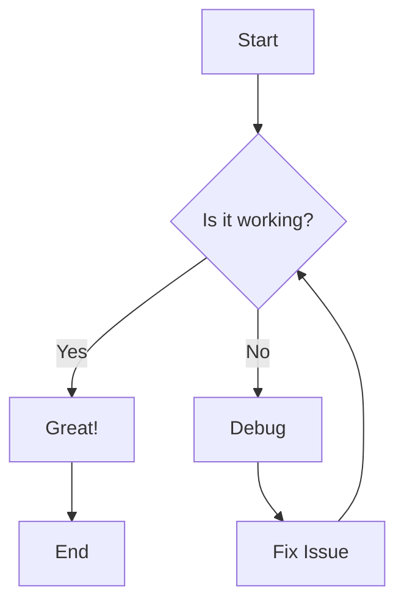
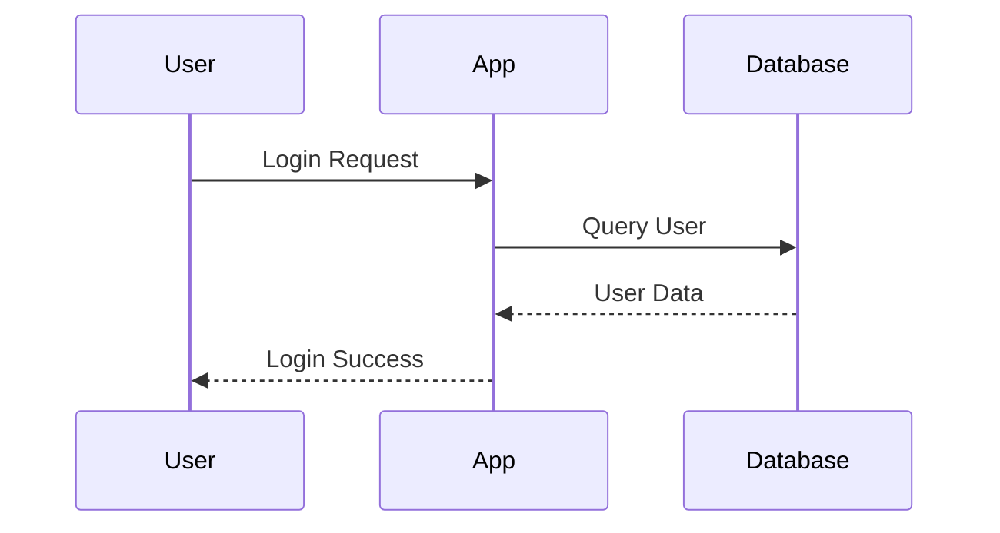
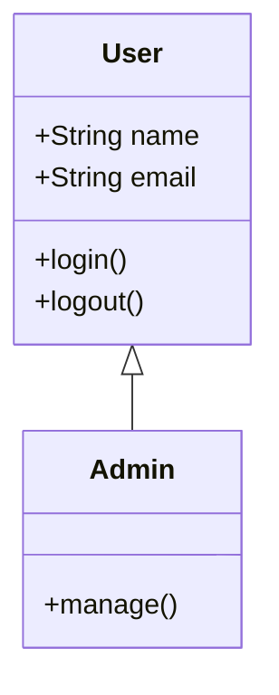
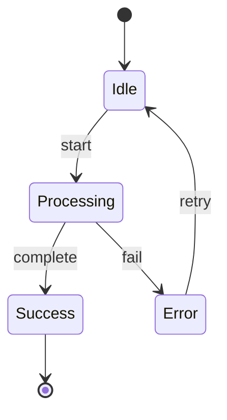
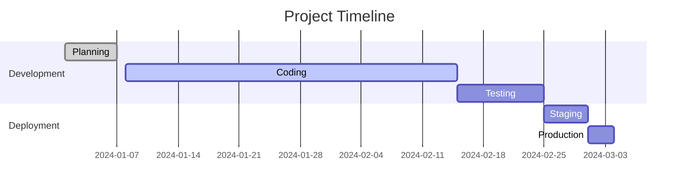
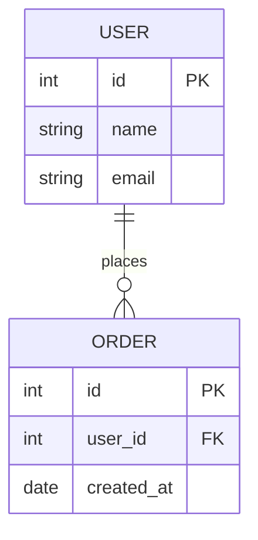

# Mermaid Examples

Examples of different Mermaid diagram types you can use in your presentations.

---

## Flowcharts



---

## Sequence Diagrams



---

## Class Diagrams



---

## State Diagrams



---

## Gantt Charts



---

## Git Graphs

```mermaid
gitgraph
    commit id: "Initial"
    branch develop
    checkout develop
    commit id: "Feature A"
    commit id: "Feature B"
    checkout main
    merge develop
    commit id: "Release v1.0"
```

---

## Entity Relationship Diagrams



---

## Thank You

Use these diagrams to make your presentations more visual and engaging!
